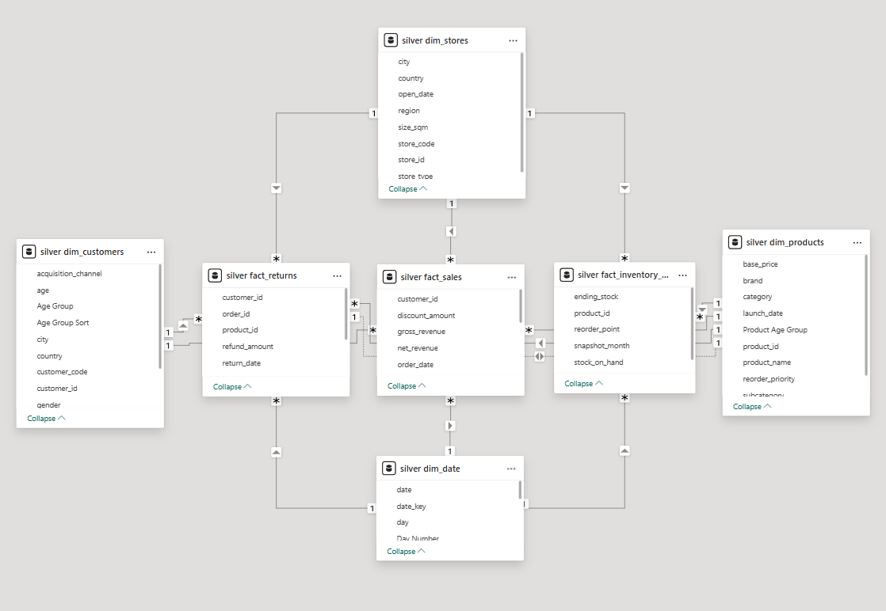
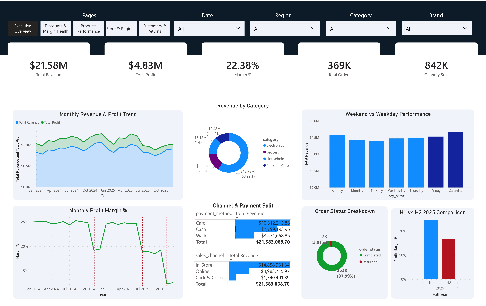
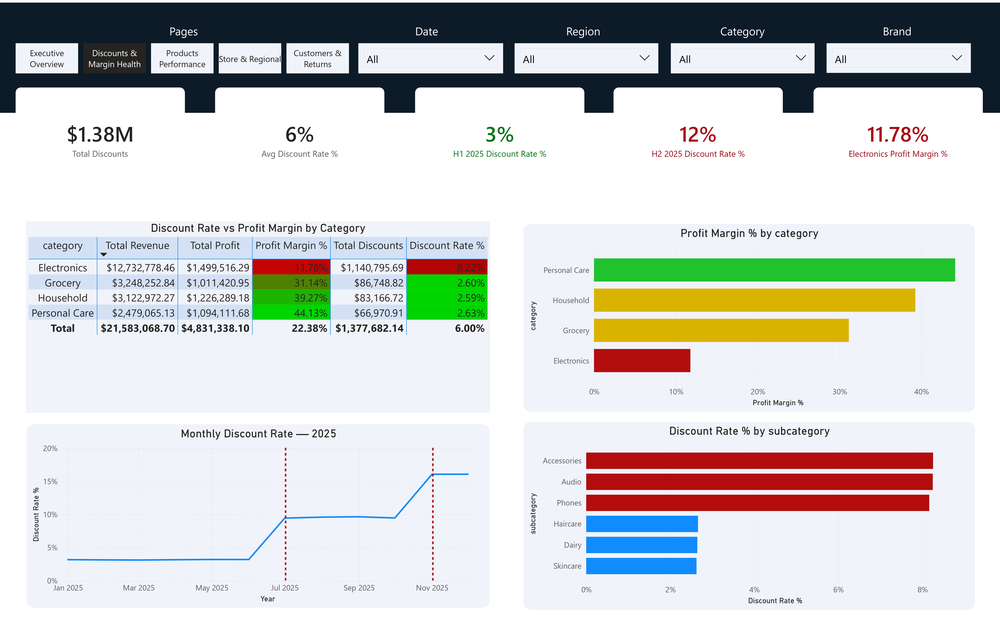
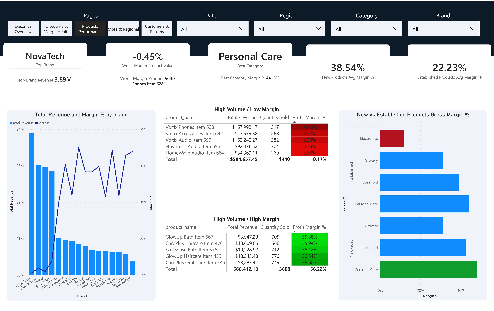
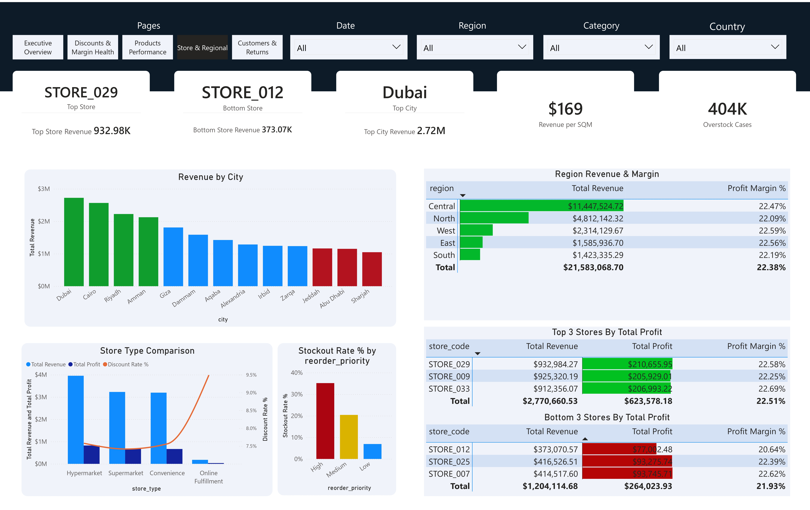
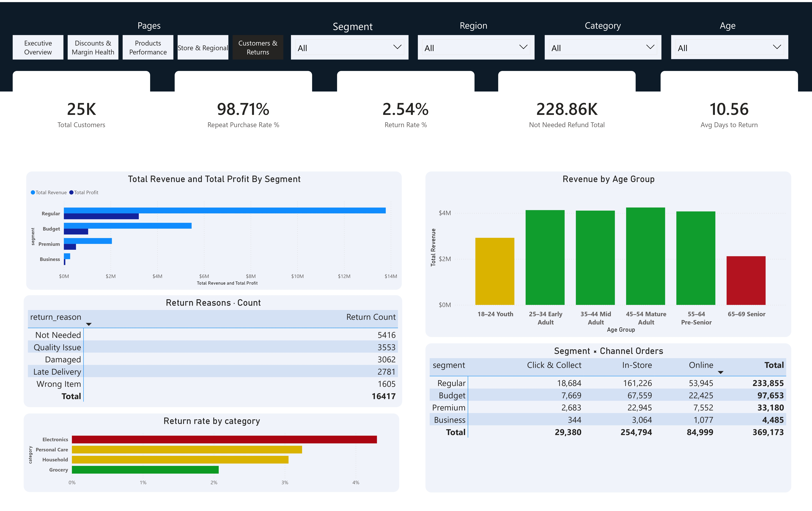

# Retail Market Performance Analysis

## Project Overview

This project is an end-to-end retail analytics case study focused on revenue performance, discount strategy, product profitability, store operations, inventory management, and customer behaviour across a MENA retail network.

The goal was to answer a realistic business question:

> Where did margin go in H2 2025, why did it happen, and what should the business do next?

The project uses **PostgreSQL ** for data engineering and business analysis, and **Power BI** for dashboard storytelling and executive reporting.

---

## Dashboard & Model Preview

| Page / View | Preview |
|---|---|
| Data Model Schema |  |
| Executive Overview |  |
| Discounts & Margin Health |  |
| Product Performance |  |
| Store & Regional |  |
| Customers & Returns |  |

---

## Business Problem

The business operates 34 retail stores across the UAE, Saudi Arabia, Egypt, and Jordan — selling Electronics, Grocery, Household, and Personal Care products. Revenue and margin held steady through most of 2024, but something shifted in H2 2025.

Leadership wants to know:

- What exactly happened to margin in H2 2025?
- Was it a volume problem or a pricing problem?
- Which categories, brands, and stores are driving or dragging performance?
- Is the Electronics discounting strategy actually working?
- Where is inventory capital being wasted, and what is it costing in lost sales?
- Which customers, channels, and acquisition sources are most valuable?
- What should the business prioritise next?

---

## Tools Used

| Tool | Purpose |
|---|---|
| PostgreSQL | Data engineering, Bronze-Silver medallion architecture, schema design |
| SQL | Revenue, discount, product, customer, store, inventory, and basket analysis |
| Power BI | Data modeling, DAX measures, dashboard design, business storytelling |
| PowerPoint | Executive findings presentation |

---

## Dataset Scope

The dataset covers two full years of synthetic retail transactions across 34 stores in 4 countries.

**Scale:** ~369,000 orders · 842,000 units sold · $21.58M total revenue · 25,000 customers · Jan 2024 – Dec 2025

> **Note on data quality:** The source dataset is clean and well-structured. The focus of this project is on data engineering, schema design, and business analysis. The Bronze layer preserves raw ingestion fidelity as TEXT, and the Silver layer enforces typing, constraints, and referential integrity through explicit SQL transformation.

**Source files:**

```text
fact_sales.csv
fact_returns.csv
fact_inventory_monthly.csv
dim_customers.csv
dim_products.csv
dim_stores.csv
dim_date.csv
```

---

## Data Architecture

### Bronze Layer

Raw landing zone. All seven source CSVs are ingested with every column stored as `TEXT` to simulate an unvalidated data lake. No transformation logic lives here.

### Silver Layer

Cleaned, typed, and constrained tables with proper primary keys, foreign keys, check constraints, and indexes. All business analysis queries run directly against Silver.

> **Architecture note:** A full medallion architecture would add a Gold layer of pre-aggregated views on top of Silver for reporting convenience. This project intentionally stops at Silver and writes all analysis queries directly against the normalised star schema using CTEs, window functions, and multi-table joins — to demonstrate SQL querying ability rather than relying on pre-built views.

```text
Bronze (raw TEXT)  →  Silver (typed + FK-enforced)  →  [Gold views — intentionally omitted]
fact_sales_raw         fact_sales
fact_returns_raw       fact_returns
fact_inventory_raw     fact_inventory_monthly
dim_customers_raw      dim_customers
dim_products_raw       dim_products
dim_stores_raw         dim_stores
dim_date_raw           dim_date
```

Load order follows FK dependency: dimensions first, then facts.

---

## Data Model

```
                    silver.dim_date
                         │
                    (order_date)
                         │
silver.dim_customers ────┤
       (customer_id)     │
                    silver.fact_sales ────── silver.fact_returns
silver.dim_products ────┤                          │
       (product_id)      │              (order_id, customer_id,
                         │               product_id, store_id)
silver.dim_stores ───────┘
       (store_id)        │
                         └──── silver.fact_inventory_monthly
                                    (store_id, product_id)
```

**Dimension tables:**

| Table | Rows | Description |
|---|---|---|
| dim_customers | 25,000 | Customer demographics, segment, acquisition channel |
| dim_products | 720 | Product catalogue with category, brand, pricing |
| dim_stores | 34 | Store details with location, type, and size |
| dim_date | 731 | Calendar table covering Jan 2024 – Dec 2025 |

**Fact tables:**

| Table | Rows | Granularity |
|---|---|---|
| fact_sales | ~369,000 | One row per order |
| fact_returns | ~16,300 | One row per return transaction |
| fact_inventory_monthly | ~587,500 | One row per store × product × month snapshot |

---

## SQL Structure

The SQL script is split into four logical parts that follow the natural flow from raw ingestion to business insight.

**Part 1 — Environment Setup & Data Ingestion (Bronze Layer)**

Creates the bronze schema, defines all raw tables with TEXT columns, and loads the seven source CSVs via `COPY`. This simulates a raw data lake where no assumptions are made about data quality at ingestion time.

**Part 2 — Data Transformation, Typing & Integrity (Silver Layer)**

Creates the silver schema with fully typed tables, primary keys, foreign keys, and check constraints. Inserts data from bronze into silver with explicit type casting. Creates indexes on all join keys and frequently filtered columns. Load order enforces referential integrity — dimensions before facts.

**Part 3 — Baseline Executive & Operational Performance Analytics**

Answers business questions across year-over-year performance, revenue and margin trends, discount rate analysis, product and brand profitability, customer segment behaviour, store and regional performance, returns analysis, and inventory health. Covers Sections 0–7 of the analysis (37 business questions).

**Part 4 — Deep-Dive Loss-Leader & Cross-Category Basket Analysis**

Tests and validates the Electronics loss-leader hypothesis. Quantifies the cross-category attachment rate, the profit difference between Electronics-only and cross-category buyers, and the exact discount rate at which the strategy stops paying for itself. Covers Section 8 of the analysis (7 business questions).

---

## Analytics Workflow

### 1. Bronze Ingestion

Source CSVs loaded into PostgreSQL using `COPY` with all columns as `TEXT`. This simulates a raw data lake where no assumptions are made about data quality at ingestion time.

---

### 2. Silver Layer — Typing and Integrity

Each table is inserted into Silver with explicit type casting, constraint enforcement, and FK validation. Check constraints cover quantity ranges, margin logic, and date ordering. Indexes are created on all join keys and frequently filtered columns.

---

### 3. SQL Business Analysis

SQL was used to answer 44 business questions across 9 sections:

- Year-over-year performance comparison
- Overall revenue, profit, and margin trends
- Discount rate analysis and H2 2025 escalation
- Product and brand profitability
- Customer segment and acquisition channel analysis
- Store, city, and regional performance
- Returns analysis and inventory health
- Sales channel and payment method breakdown
- Cross-category basket analysis and discount breakeven modelling

Examples of business questions answered:

- What happened to margin in H2 2025 — volume or pricing?
- Which categories drive revenue vs which drive profit?
- At what discount rate does the Electronics strategy stop paying for itself?
- Do Electronics buyers actually purchase other categories, and how much extra profit do they generate?
- Which stores are underperforming and why?
- Where is inventory capital being misallocated?
- Which customer acquisition channel has the best return on cost?
- What is the financial impact of discretionary "Not Needed" returns?

---

## Power BI Dashboard

The Power BI dashboard contains 5 decision-focused pages with cross-page filters for Date, Region, Category, and Brand.

### 1. Executive Overview

Purpose:

> Show the overall business performance and frame the H2 2025 margin story.

Key metrics:

- Total revenue: **$21.58M**
- Total profit: **$4.83M**
- Gross margin: **22.38%**
- Total orders: **369K**
- Repeat purchase rate: **98.71%**
- Return rate: **2.54%**

---

### 2. Discounts & Margin Health

Purpose:

> Show exactly where and when discounting got out of range, and what it cost.

Key findings:

- Blended discount rate: **6%** across the full period
- H1 2025 discount rate: **3.17%** — within a healthy range
- H2 2025 discount rate: **12.02%** — nearly 4× higher than H1
- Electronics discount rate in H2: **17.22%**, up from 4.36% in H1
- Electronics profit margin in H2: **1.8%**, down from 15.4% in H1
- All brands and subcategories moved at the same time — centrally driven

---

### 3. Product Performance

Purpose:

> Identify which products, brands, and categories are creating value vs consuming it.

Key findings:

- Top brand by revenue: **NovaTech** at $3.89M
- Best margin category: **Personal Care** at 44.13%
- Only product with negative total profit: **Voltix Phones Item 628** at −0.45%
- New products (launched 2025) average margin: **38.54%** vs 22.23% for established products
- 97%+ of Electronics buyers also purchase higher-margin categories

---

### 4. Store & Regional

Purpose:

> Show where the business is strongest, where it is weakest, and where inventory is misaligned.

Key findings:

- Top store: **STORE_029** (Cairo Hypermarket) — $932K revenue
- Bottom store: **STORE_012** (Online Fulfillment) — $373K, highest discount rate at 7.94%, lowest margin at 20.64%
- Top city: **Dubai** at $2.72M revenue
- All five regions operate at near-identical margins (~22%) — confirms central rather than regional discount decisions
- Central region simultaneously holds **94K+ overstock cases** in Grocery and **40K+ stockout cases** in Electronics

---

### 5. Customers & Returns

Purpose:

> Understand which customer groups generate value, why customers are returning products, and how acquisition channels compare.

Key findings:

- Repeat purchase rate: **98.71%** — the customer base is healthy
- "Not Needed" returns: **5,416 returns, $229K in refunds** — the only return reason with no operational failure behind it
- Electronics return rate: **4.3%** — more than double Grocery at 2.07%
- Referral channel: only **2,015 customers** but near-zero acquisition cost — the highest-ROI channel in the business
- All acquisition channels deliver near-identical profit per customer (~$190)

---

## Key Business Findings

### 1. The H2 2025 margin drop was a discount problem, not a volume problem

Revenue fell 11% in H2 2025. Profit fell 40%. A volume dip alone does not produce that ratio. The Electronics discount rate jumped from 4.36% in H1 to 17.22% in H2, uniformly across all brands and subcategories simultaneously — a central decision, not a local one.

### 2. Electronics discounting is the right strategy — just not at 17%

97%+ of Electronics buyers also purchase higher-margin categories. A customer who buys Electronics and at least one other category generates **$226 average profit** — versus **$44 for Electronics-only buyers**. The discount is what drives that cross-category behaviour. The sweet spot is 8–9%: below that level, the broader basket profit covers the discount. Above it, the numbers no longer work.

### 3. Inventory capital is misallocated in the Central region

The Central region — the company's largest at $11.4M revenue — simultaneously holds 94K+ overstock cases in Grocery and 40K+ stockout cases in Electronics. Every Electronics stockout is a lost sale worth approximately $226 in cross-category profit, not just the unit price.

### 4. The referral channel is the highest-return acquisition channel

All channels deliver approximately the same profit per customer (~$190), but Referral does it at near-zero acquisition cost. With only 2,015 customers, it is the smallest channel by volume and the most capital-efficient channel in the business.

### 5. "Not Needed" returns represent recoverable margin

5,416 discretionary returns totalling $229K in refunds have no operational failure behind them. A modest policy adjustment — a shorter return window or a restocking fee — could recover $23K–$34K annually with no change to the customer experience for legitimate returns.

---

## Recommendations

### 1. Cap Electronics discounts at 8–9%

Set a clear discount ceiling with commercial director sign-off required for any exception. This preserves the cross-category strategy that is clearly working while preventing the escalation seen in H2 2025.

### 2. Rebalance Central region inventory

Reduce Grocery, Household, and Personal Care reorder points in Central by 20–30%. Redirect the freed working capital toward Electronics replenishment. Electronics stockouts cost far more than their face value because of lost cross-category sales.

### 3. Launch a referral programme

Referral already delivers the same per-customer profit as every other channel at near-zero cost. A structured programme with dual-sided incentives — rewards for both the referring customer and the new one — is the highest-leverage growth action available without increasing the marketing budget.

### 4. Review the "Not Needed" returns process

Pilot a 14-day return window or a restocking fee for discretionary returns in one region. Measure the impact on refund volume before full rollout.

### 5. Protect Personal Care and NovaTech from discount pressure

Personal Care has the highest margin in the portfolio (44.13%) and the lowest discount rate (2.63%). NovaTech delivers the highest revenue of any brand with meaningfully better margins than Voltix. Both are priorities for placement, SKU expansion, and protection from promotional discounting.

---

## Suggested 90-Day Action Roadmap

### 0–30 Days: Pricing triage

- Set an interim Electronics discount ceiling at 8–9%
- Require commercial director approval for any exception above that level
- Review Q4 2024 and H2 2025 discount decisions to understand what drove the escalation

### 31–60 Days: Inventory and growth

- Audit Central region reorder points for Grocery, Household, and Personal Care
- Redirect freed inventory budget toward Electronics replenishment
- Design and launch a referral programme with dual-sided incentives
- Pilot the "Not Needed" returns policy in one region

### 61–60 Days: Measure and report

- Track monthly discount rate and margin by category
- Monitor Electronics stockout rate in Central
- Measure referral programme volume vs cost-per-acquisition
- Report progress to commercial and operations leadership using the dashboard

---

## Project Files

```text
retail-market-analysis/
│
├── data/                            # Synthetic source CSVs (Not tracked in git)
│   ├── fact_sales.csv
│   ├── fact_returns.csv
│   ├── fact_inventory_monthly.csv
│   ├── dim_customers.csv
│   ├── dim_products.csv
│   ├── dim_stores.csv
│   └── dim_date.csv
│
├── sql/
│   ├── 01_bronze_layer.sql          # Environment reset & raw CSV text ingestion
│   ├── 02_silver_layer.sql          # Type-casting, structural constraints, & optimization indexes
│   ├── 03_baseline_analytics.sql    # Executive macro performance & regional summaries
│   └── 04_operational_deep_dives.sql # Loss-leader thresholds, stockout tracking, & basket attachment
│
├── images/                          # Documentation schemas and dashboard layouts
│   ├── data_model_schema.png
│   ├── executive_overview.png
│   ├── discounts_margin.png
│   ├── product_performance.png
│   ├── store_regional.png
│   └── customers_returns.png
│
└── README.md
```

---

## How to Run

**Prerequisites:** PostgreSQL 13+, source CSV files saved locally.

```bash
psql -U your_user -d your_database -f sql/retail_analysis.sql
```

Update the `COPY` file paths at the top of the script to match your local data directory before running. The script is idempotent — it drops and recreates both schemas on every run.

---

## Skills Demonstrated

### What made this project technically challenging

- **Bronze-Silver architecture without a Gold layer (intentional)** — a standard medallion setup would add a Gold layer of pre-aggregated views to simplify reporting queries. This project deliberately skips that step. All 44 business queries are written directly against the normalised Silver star schema — requiring multi-join CTEs, window functions, and conditional aggregations from scratch. The goal was to demonstrate SQL querying ability on a real schema, not on a pre-flattened convenience layer.
- **Bronze-Silver data pipeline** — all seven source tables ingested as raw TEXT in Bronze, then re-typed with full FK constraints, check constraints, and indexes in Silver. Load order enforces referential integrity at insertion time.
- **Cross-category basket analysis** — identified that 97%+ of Electronics buyers also purchase other categories, then quantified the profit difference: $226 average profit for cross-category buyers vs $44 for Electronics-only buyers. Built a discount breakeven model showing the exact rate (8–9%) at which the strategy stops paying for itself.
- **H2 discount spike forensics** — used conditional aggregation across brands and subcategories to confirm that the H2 2025 rate jump was uniform across NovaTech, Voltix, SoundArc, and HomeWave simultaneously — ruling out a product mix shift or a single brand decision and pointing to a central pricing change.
- **Inventory misalignment analysis** — cross-referenced overstock and stockout cases at category × region level to surface the Central region holding 94K+ excess Grocery cases while running 40K+ Electronics stockouts in the same period.
- **DAX in Power BI** — wrote dynamic KPI measures for discount rate by half-year, cross-category attachment rate, breakeven threshold indicators, and margin variance by period.
- **Discount breakeven modelling** — built an H1 vs H2 customer-level profit comparison showing that cross-category profit stayed flat ($37–41) across both halves, confirming the entire margin drop came from Electronics margin compression, not from customers changing their buying behaviour.

---

## Key Metrics Used

| Metric | Meaning |
|---|---|
| Gross margin % | Profit as a percentage of net revenue |
| Discount rate % | Discount amount as a percentage of gross revenue |
| Cross-category attachment rate | Percentage of Electronics buyers who also purchase another category |
| Avg profit per customer | Total profit divided by number of unique customers |
| Breakeven discount ceiling | The discount rate above which cross-category profit no longer covers Electronics margin compression |
| Stockout cases | Inventory snapshot months where ending stock fell below the reorder point |
| Overstock cases | Inventory snapshot months where stock on hand exceeded twice the reorder point |
| Return rate % | Returned units as a percentage of total units sold |

---

## Limitations

- The dataset is synthetic and used for portfolio and learning purposes.
- The cross-category attachment rate is measured at customer lifetime level across the full dataset period, not within individual orders. Individual orders are single-category; the cross-category behaviour reflects customers returning across multiple purchase occasions.
- Inventory analysis uses monthly snapshot data, so intra-month stockouts are not captured.
- The breakeven discount ceiling is based on observed average order values and cross-category profit for 2025. Changes in basket size or category mix would shift the threshold.
- The H2 discount escalation analysis identifies the pattern as centrally applied based on uniformity across brands and subcategories. The specific business decision behind it is not captured in the dataset.

---

## Final Summary

This project found that the business's H2 2025 profit drop was driven by an Electronics discount rate that climbed from 4% to 17% — not by weaker customer demand or volume loss.

The Electronics discounting strategy itself is sound: nearly all Electronics buyers generate significantly more profit when they buy across categories. The problem was the depth, not the strategy.

The recommended focus areas are:

- A discount ceiling at 8–9% for Electronics with a clear approval process for exceptions
- Inventory rebalancing in the Central region to eliminate Electronics stockouts
- A referral programme to grow the highest-ROI acquisition channel
- A review of discretionary returns to recover a portion of $229K in annual refund exposure
- Protection of Personal Care and NovaTech from discount pressure — both are the strongest margin contributors in their respective tiers

---

**Author:** Mohammad
**LinkedIn:** *(add your profile link)*
**Tools:** PostgreSQL · Power BI · DAX · SQL
